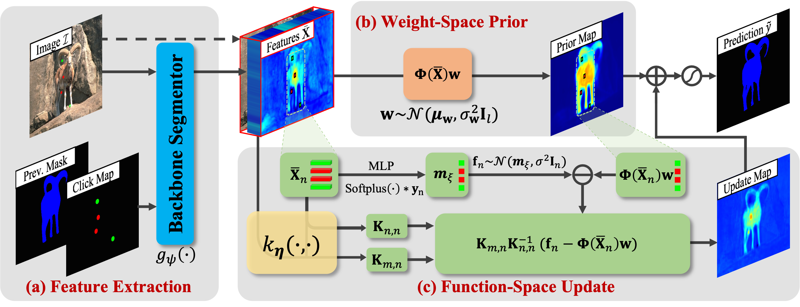

# Interactive Segmentation as Gaussian Process Classification (CVPR2023)
Minghao Zhou, [Hong Wang](https://hongwang01.github.io/), Qian Zhao, Yuexiang Li, Yawen Huang, [Deyu Meng](http://gr.xjtu.edu.cn/web/dymeng), [Yefeng Zheng](https://sites.google.com/site/yefengzheng/)

## Abstract
Click-based interactive segmentation (IS) aims to extract the target objects under user interaction. For this task, most of the current deep learning (DL)-based methods mainly follow the general pipelines of semantic segmentation. Albeit achieving promising performance, they do not fully and explicitly utilize and propagate the click information, inevitably leading to unsatisfactory segmentation results, even at clicked points. Against this issue, in this paper, we propose to formulate the IS task as a Gaussian process (GP)-based pixel-wise binary classification model on each image. To solve this model, we utilize amortized variational inference to approximate the intractable GP posterior in a data-driven manner and then decouple the approximated GP posterior into double space forms for efficient sampling with linear complexity. Then, we correspondingly construct a GP classification framework, named GPCIS, which is integrated with the deep kernel learning mechanism for more flexibility. The main specificities of the proposed GPCIS lie in: 1) Under the explicit guidance of the derived GP posterior, the information contained in clicks can be finely propagated to the entire image and then boost the segmentation; 2) The accuracy of predictions at clicks has good theoretical support. These merits of GPCIS as well as its good generality and high efficiency are substantiated by comprehensive experiments conducted on several benchmarks, as compared with representative methods both quantitatively and qualitatively.

## Overview of GPCIS

